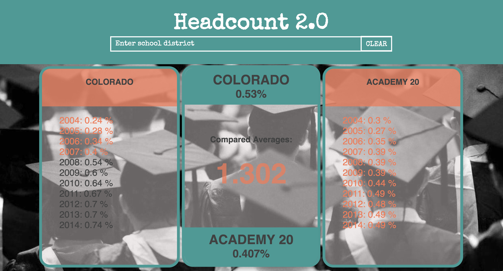

# HeadCount 2.0
## Group: Sabrina Kennedy, Om Saetehn, and Jonathan Sweet

## Description

This project served as practice with data manipulation and effective munging and packaging for use in a web application. The application itself is built with React with state management at the component level. Provided with data for kindergarten enrollements in districts throughout Colorado, the application allows for the user to search by district and compare the average enrollment of kindergartners in full day programs for up to two districts at a time. 

## Set Up

Clone this project

Run `npm install` from the root directory

Run `npm start`

You can run the testing suite with `npm test`.

## Future

Additional data is available that will allow for a future feature to include buttons in the header that would allow the user to select what kind of district data they wish to compare, including but not limited to highschool enrollment and graduation rates.

## Screenshot
