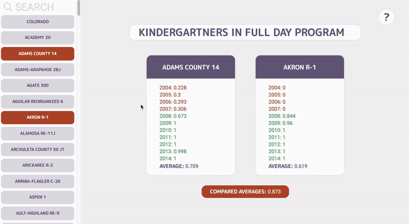
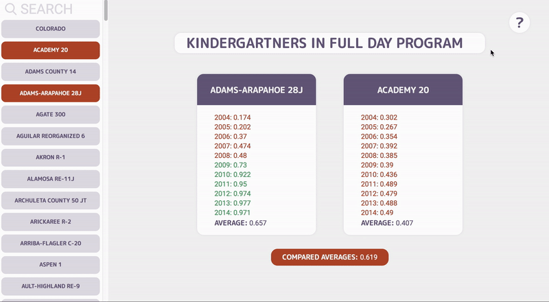

# HeadCount 2.0

HeadCount 2.0 is a project designed to manipulate data and create small, reusable React components. It imports files containing various educational stats from districts within Colorado by year, per district. 

## Set Up

Clone this project

Run `npm install` from the root directory

Run `npm start` and visit localhost:3000 in your browser

You can run tests with `npm test`

## Project Goals

* Separate application logic into small, testable functions.
* Create modular, reusable React components.
* Use propTypes to validate props passed to each component.
* Write meaningful, comprehensive unit and integration tests.

## Final Result
  
  