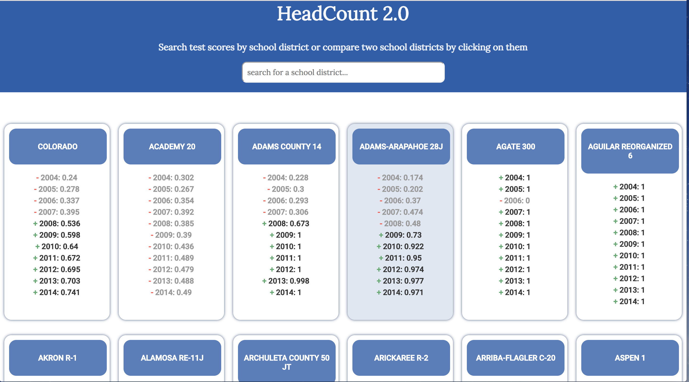
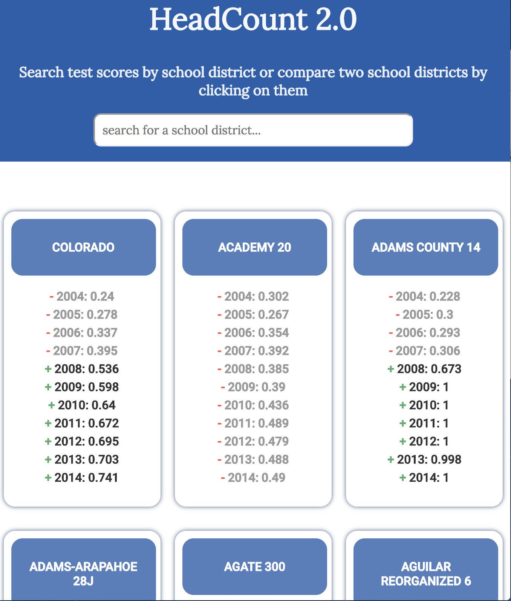
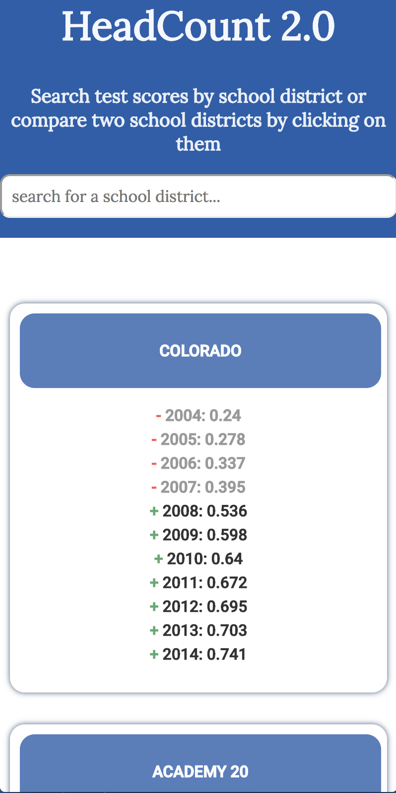
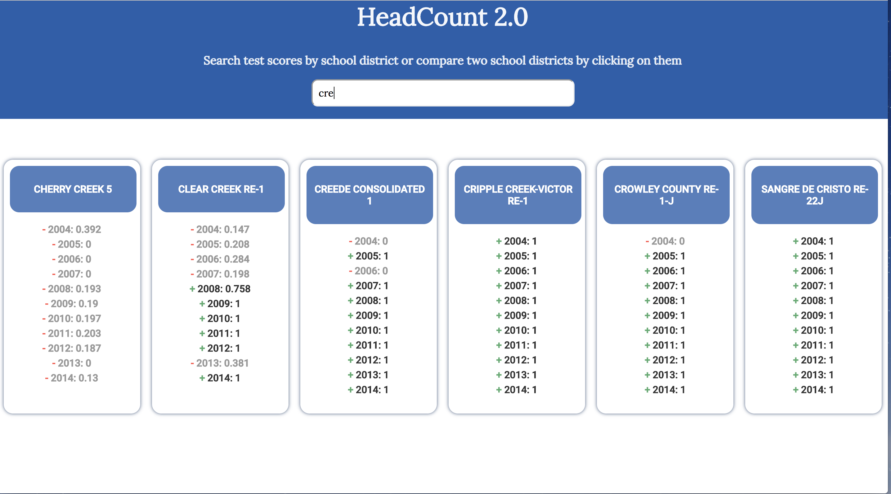
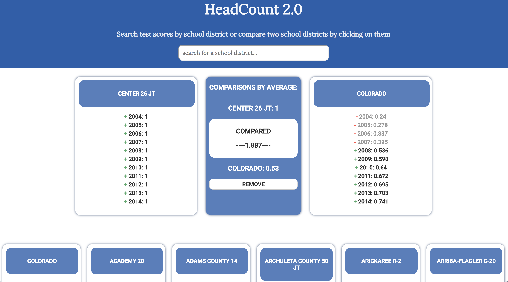

# HeadCount 2.0 

Team: Tanj McMeans

HeadCount 2.0 is a project designed to challenge my skills at manipulating data and creating small, reusable React components. For each iteration of the project, I focused on being able to access, manipulate, filter, find and compare data using the Colorado Kindergarten school district test scores object as a sample. 

This application was built using the `create-react-app` boilerplate and styled and made responsive with CSS.

Goals for this project =>

* Separate application logic into small, testable functions.
* Create modular, reusable React components.
* Use propTypes to validate props passed to each component.
* Write meaningful, comprehensive unit and integration tests.

## How to Use

Fork or clone down this project =>

Run `npm install` from the root directory
Run `npm start` and visit localhost:3000 in your browser
You can begin running tests with `npm test`

## Functionality

  

 

  

  

  

